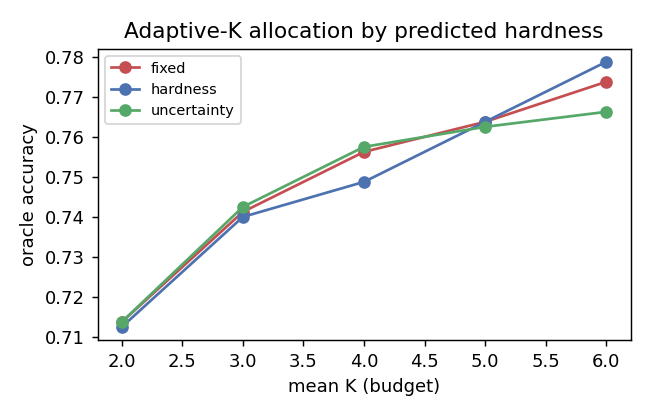

# Adaptive-K Allocation — Results, Findings & Follow-On

Focused write-up of the adaptive-sample-allocation experiment (Stage C2), the null
result, *why* it is null, and the two follow-on directions it points to: (1) harder /
wider-difficulty math benchmarks, and (2) mid-trajectory adaptive methods.

Figure: `../ziprc_results/figures_scaled/adaptive_k.png` · code: `adaptive_k.py`.

---

## 1. What adaptive-K is

The ZIP-RC head's `value_first` — its predicted value at the **prompt** (before any
sampling) — is a per-prompt **difficulty estimate** (AUC 0.85 vs eventual correctness).
Adaptive-K uses it to spend a fixed *average* sample budget **unevenly**: more samples on
predicted-hard prompts, fewer on easy ones. It captures branching's "reallocate compute"
idea *without* KV-cache surgery, and is fully **offline** (reuses already-generated rollouts).

Three allocation schemes, all at matched mean-K:
- **fixed** — every prompt gets the same K (baseline).
- **hardness** — `K_i ∝ (1 − d_i)` (more to predicted-hard).
- **uncertainty** — `K_i ∝ d_i(1 − d_i)` (more to medium-difficulty, where extra tries flip).

---

## 2. Results — a non-replicating small gain (i.e. null)

| Run | Head | Eval | hardness − fixed (oracle), mean-K 2–6 |
|---|---|---|---|
| 1 | 256-prompt head | 50 held-out | **+0.006 … +0.019** (small, consistent sign) |
| 2 | 512-prompt head (scaled) | 50 held-out | **≈ 0** (mixed sign, ±0.007) |

The suggestive gain on the smaller head **did not replicate** on the better, scaled head.
The figure shows it directly: the three curves **overlap and cross** — `hardness` edges
ahead only at mean-K = 6 and dips *below* `fixed` at mean-K = 4. **Net: null on Countdown.**

### Why it's null (and why that's informative)
- `value_first` **ranks** difficulty well (AUC 0.85) but has a **tiny absolute dynamic
  range** (raw values compressed to ≈ [0.52, 0.54]); we therefore allocate by **percentile
  rank**, not the raw value (a real bug-fix — raw-value allocation gave exactly 0 gain).
- Even with rank allocation, **Countdown's prompt-difficulty spread is narrow** — most
  3–4-number prompts are similar difficulty — so there is little headroom to *reallocate*.
- **The null is a property of the task, not the mechanism.** Allocating compute by
  predicted difficulty is sound; Countdown simply lacks the difficulty *variance* to exploit.

This is the key handoff to the follow-on work.

---

## 2b. Experimental resolution — *start-based* fails, *mid-trajectory* works (`adaptive_k_mid.py`)

We ran the harder-Countdown experiment (`EXPERIMENT_difficulty.md`) and the mid-trajectory fix.
Two findings:

**(i) Harder difficulty alone did NOT fix it — and *why* is the real result.** Operand
cardinality 3→6 created huge true-difficulty variance (pass@1 by tier: 0.72 / 0.31 / 0.00 /
0.00 — 5–6-number Countdown is fully OOD for the RLOO policy). Yet adaptive-K stayed null,
because **the head's *prompt-level* prediction collapses OOD:**

| read point | value_first (0%) | value_q25 (25%) | value_mean | value_end |
|---|---|---|---|---|
| AUC (hard set) | **0.237** (below chance!) | **0.842** | 0.951 | 0.962 |

The OOD policy doesn't *represent* that a 6-number problem is hopeless at the prompt, so the
head can't read difficulty there (it's even mildly *misled* — more numbers look like more
opportunity). **Introspection is bounded by the policy's own self-knowledge:** it can tell
*"is this trajectory succeeding"* (value_q25/_end) but not *"can I do this at all"*
(value_first) when OOD.

**(ii) Allocating from a *mid-trajectory* probe fixes it.** A two-stage allocator — probe 2
samples, read `value_q25`, then pour the remaining budget into unsolved-but-promising prompts
— gives a **consistent +1.5 oracle points** with the mid signal vs **~0** with the start
signal (the controlled contrast):

| mean-K | promise gain @ value_q25 (mid) | @ value_first (start) |
|---|---|---|
| 3–5 | **+0.015** | ≈ 0 |

(A signal-independent ~+0.01 also comes from the two-stage structure itself — a verifiable
probe lets you stop re-sampling already-solved prompts.) Magnitude is capped by the hopeless
5–6-number tail that no allocation can help; the action is on the tier-4 frontier. The real
*online* version (probe to ~25%, then spend fresh generation, ideally on `value_mean`, AUC
0.95) is the natural next build. **This is the central practical takeaway: do adaptive-K from
a mid-trajectory read, not from the prompt** — and it connects to `AGENT_DIRECTIONS.md` (an
SLM can introspect to abort/escalate *after starting*, but not route *before trying*, OOD).

## 2c. Online probe-and-reallocate — end-to-end (`allocate_budget.py` + `probe_eval.py`)

We built the live version: probe 2 samples per prompt, read `value_q25`, **generate only
FRESH extras** on the unsolved-but-promising frontier (per-prompt variable sampling via
`gen_rollouts --n-col`), and compare to fixed-K at matched mean budget — with real generation
and true compute accounting (not the offline pool).

> **Which lever is this?** Adaptive-K is a *budget* lever (how many whole samples each prompt
> gets, **across prompts**) — distinct from the *within-prompt* meta-actions in
> `adaptive_decode.py`: **prune** (compute axis: kill predicted-loser samples mid-generation)
> and **earlystop** (latency axis: commit to a confident sample, stop the rest). Here every
> sample (probe + extras) is generated **to completion** — no token-level prune/earlystop. The
> savings come only from spending *fewer whole samples* on solved/hopeless prompts (a
> prompt-level analog of skip-solved + give-up). The three levers are **composable**: a full
> system would prune *within* each sample and reallocate samples *across* prompts.

| budget B | adaptive (probe + reallocate) | fixed@B | gain |
|---|---|---|---|
| 3 | 0.338 | 0.338 | +0.000 |
| 4 | **0.371** | 0.346 | **+0.025** |
| 6 | **0.371** | 0.354 | **+0.017** |
| 8 | 0.358 | 0.354 | +0.004 |

- **Online beats fixed-K at matched budget**, by *more* than the offline proxy (+0.025 vs
  +0.015 at B=4) — the online version isn't capped at a fixed pool of 8.
- **The gain is an inverted-U in budget, governed by the cap (`kmax`) — not the budget itself.**
  At **B=3** there's too little to reallocate (~1 extra/prompt → adaptive ≈ fixed, **+0.000**); it
  peaks at **B=4 (+0.025)**; then *collapses* at **B=8 (+0.004)** — not because budget is wasted but
  because the budget approaches the cap (`kmax=8`; mean cost 6.08, every unsolved prompt maxed out),
  leaving adaptive **no room to concentrate**. §2d shows that *raising the cap* rescues the
  high-budget gain — so the governing lever is **cap headroom (`kmax − meanK`)**, not budget.
- **Adaptive plateaus at 0.371** because of the hopeless tail (tiers 5–6, 0% solvable — no
  allocation helps); the action is the tier-4 frontier. **32% of prompts were solved by the
  2-sample probe and got zero extra**, freeing that budget for the frontier.
- **Leakage-clean:** train/test problem-disjoint (`leakage_check.py`), and the probe samples
  are disjoint from the evaluated extras by construction.

**Bottom line:** mid-trajectory adaptive-K works end-to-end on a task where start-based
allocation cannot, and the efficiency win is real wherever the budget leaves the cap **headroom
to concentrate** (§2d) — not at any one magic budget.

---

## 2d. The governing lever is cap headroom, not budget (`allocate_budget.py --kmax` sweep)

The B-curve above hides a confound: budget `B` and cap `kmax=8` move together, so "the gain
dies at B=8" could be *budget saturation* or *cap saturation*. We separated them with a clean,
**same-pool, 24-seed** offline sweep (`adaptive_k_mid` on the fresh 16-sample pool, so the cap
can range up to 16 without re-confounding generation). Gain over fixed at matched mean budget:

| mean budget | `kmax=8` (cap binds) | `kmax=16` (headroom) |
|---|---|---|
| 4 | frontier +0.008 / promise +0.015 | +0.008 / +0.015 |
| 6 | +0.009 / +0.010 | +0.011 / **+0.015** |
| 8 | **+0.000 / +0.000**  ← saturated | **+0.012 / +0.016**  ← rescued |

- **Cap headroom — not budget — governs the gain.** At `meanK=8` the gain vanishes *only* when
  `kmax=8` (no prompt can exceed the cap → adaptive collapses to uniform). Raise the cap to 16 and
  the same budget keeps **+0.012–0.016**. Keep `kmax > meanK` and the gain persists at *any* budget.
- **This corrects an earlier confounded single run** (a fresh-pool `kmax=16` point read +0.004 and
  briefly suggested "raising the cap doesn't help / over-concentration hurts"). The clean
  multi-seed test refutes that: at matched budget, **more cap headroom strictly ≥ less** — the
  +0.004 was generation noise, not a real over-concentration penalty.
- **`promise` ≥ `frontier` on this hard pool** (+0.015–0.016 vs +0.008–0.012): when the tail is
  mostly hopeless, concentrating on the *highest-promise* unsolved prompts beats hedging the
  50/50 boundary. (On an easier pool with a flippable middle, `frontier` should win — worth a sweep.)
- **Offline gains (+0.008–0.016) < online (+0.017–0.025)** because offline redraws extras from a
  fixed 16-pool (limited diversity, averaged over seeds), while online generates *fresh* extras.
  Offline is the conservative, low-variance estimate; both agree on the cap-headroom mechanism.

**Bottom line (§2d):** to *preserve* the adaptive-K gain as you scale budget, raise the **cap**
(`kmax`), not the budget — give the frontier room to absorb samples. The original "raise kmax"
intuition was right; the clean experiment was needed to see past the single-run noise.

---

## 3. Follow-on 1 — harder, wider-difficulty math benchmarks

**Hypothesis:** adaptive-K's gain should scale with the **variance** of prompt difficulty.
Countdown is narrow; competition math is wide and often **difficulty-labeled**, giving a
clean way to test whether the gain appears (and to *stratify* it by tier).

Candidate benchmarks (chosen for wide, ideally labeled, difficulty):
- **Omni-MATH** — 4,428 olympiad problems, **5 difficulty tiers (T0–T4)**, 33 sub-domains;
  built-in labels make the difficulty-variance hypothesis directly testable
  ([Gao et al., ICLR 2025](https://arxiv.org/abs/2410.07985)).
- **MATH** (Hendrycks et al. 2021) — the classic, with **5 difficulty levels** for stratification.
- **OlympiadBench / OlymMATH / [AMO-Bench](https://arxiv.org/abs/2510.26768)** — olympiad-level,
  high difficulty variance and a long hard tail.
- **AIME 2024 / AMC 2023** — the exact mixed-difficulty benchmarks ZIP-RC itself evaluated on.
- **DeepScaleR** — ZIP-RC's training corpus (DeepScaleR + MATH + GSM8K), a ready wide-difficulty pool.
- See also [*Inference-Time Scaling for Complex Tasks: Where We Stand*](https://arxiv.org/abs/2504.00294)
  for current TTS scaling behavior on hard tasks.

**Proposed experiment.** Train the ZIP-RC head on a wide-difficulty corpus; measure
`adaptive-K (hardness)` − `fixed` at matched budget, **stratified by difficulty tier**, and
plot the gain against an empirical difficulty-variance statistic. Prediction: the gain
emerges and grows with spread — turning the Countdown null into a positive *where it should
matter*. A cheap controlled knob first: **harder Countdown** (5–6 numbers, larger targets)
to widen difficulty variance without changing task family.

---

## 4. Follow-on 2 — mid-trajectory adaptive methods

Adaptive-K acts **once, pre-generation** (per prompt). The richer signal is the head's value
**per step during generation** — and our `prune`/`earlystop` decoder already exploits it.
Moving the difficulty signal from `value_first` (prompt) to the **per-step value trajectory**
turns a one-shot allocation into a continual *re-allocation* (the natural next version of
adaptive-K). Related work to build on:

| Work | Idea (mid-trajectory / adaptive compute) |
|---|---|
| [Manvi et al. 2024](https://arxiv.org/abs/2410.02725) | LLMs predict success **mid-generation** (ZIP-RC's predecessor) |
| [Manvi et al. 2025 — ZIP-RC](https://arxiv.org/abs/2512.01457) | Zero-overhead joint reward–cost prediction (our base method) |
| [Re-FORC (2025)](https://arxiv.org/abs/2511.02130) | **Adaptive reward prediction** for efficient CoT — closest neighbor |
| [S-GRPO (2025)](https://arxiv.org/abs/2505.07686) | RL-learned **early exit** in reasoning models |
| [Self-Braking Tuning (2025)](https://arxiv.org/abs/2505.14604) | Curb **overthinking** by learned stopping |
| [LATTS (2025)](https://arxiv.org/abs/2509.20368) | **Locally adaptive** test-time scaling (per-step compute) |
| [Optimal Bayesian Stopping (2026)](https://arxiv.org/abs/2602.05395) | Principled stop rule for consistent answers |
| Aggarwal et al. (Adaptive Consistency) / Speculative Rejection | stop sampling / prune BoN once confident |
| PRMs — Lightman et al.; Math-Shepherd; GenPRM | step-level value for mid-trajectory pruning/branching |
| [Survey: Adaptive & Controllable TTS (2025)](https://arxiv.org/abs/2507.02076) · [Awesome-Efficient-Reasoning](https://github.com/Eclipsess/Awesome-Efficient-Reasoning-LLMs) | landscape |

**The opportunity.** Unify the two halves into a single budget controller — prompt-level
allocation (adaptive-K) *plus* mid-trajectory prune/early-stop — driven by one zero-overhead
ZIP-RC signal, and benchmarked on a **wide-difficulty** suite where the prompt-difficulty
signal has room to act. That directly addresses the Countdown null on both fronts.

### 4b. Blending all three levers — composability, risks, and a staged plan

The three meta-actions act on **orthogonal axes**, so a blend should make the savings *compound*
(multiplicative), not merely add:

| lever | axis | scope | decision |
|---|---|---|---|
| **adaptive-K** | budget | *across* prompts | how many whole samples this prompt gets |
| **prune** | compute | *within* a sample | kill this token-stream mid-generation |
| **earlystop** | latency | *within* a prompt | commit to a confident sample, stop the rest |

**What can go wrong** (all read the *same* head, so errors are *not* independent):
1. **Correlated failure.** Where the head is miscalibrated they fail *together* — e.g. the OOD
   `value_first` collapse (AUC 0.237) would mis-allocate *and* mis-prune *and* mis-commit on
   exactly the hard prompts. Design it out by **read-point per lever** (allocate on `value_q25`+,
   never `value_first`; prune on per-step value).
2. **Levers fight.** adaptive-K *invests* extra samples in an uncertain prompt; prune then *kills*
   them; earlystop *commits* before they pay off. The §2d **cap-saturation** result is the baby
   version: spending more in one place has diminishing returns.
3. **Budget-unit mismatch.** adaptive-K allocates *samples*; prune/earlystop change the *token cost*
   per sample — so "6 samples" stops being fixed compute. Correct allocation needs **per-sample
   length prediction → the length head, our weakest component.** This is the gating dependency.
4. **Premature commitment on the frontier.** earlystop commits on confidence, but adaptive-K sends
   extras to *uncertain* prompts — a confident-but-wrong sample gets committed, defeating the spend.
5. **Objective conflict.** prune optimizes tokens, earlystop optimizes wall-clock; without **one**
   utility they pull apart. **Evaluation illusion:** mean accuracy can hold while the *frontier*
   slice degrades — needs slice-wise CLEAR accounting.

**Best implementation — one utility, staged rollout.** Lift ZIP-RC's sampling utility to the batch:
maximize **U = E[max reward] − β·(α·compute + (1−α)·latency)** with all three meta-actions read off
the *same* joint (reward, length) prediction (this is Direction C in `AGENT_DIRECTIONS.md`). Stage it:
1. **Compose the two compute-axis levers first** (adaptive-K + prune) — they *align* (both avoid
   wasting compute on doomed work), least conflict; prove savings compound.
2. **Couple within-prompt aggressiveness to the allocation:** frontier prompts (high `n_extra`) get
   *conservative* prune/earlystop thresholds (protect the exploration adaptive-K paid for);
   solved/hopeless prompts get *aggressive* prune (reclaim compute). Now the levers *cooperate*.
3. **Allocate in compute units, not samples** — requires hardening the length head first (or feed
   back *realized* length as a running estimate).
4. **Only then add earlystop** under the unified α-utility; validate on held-out + seeds + slice-wise.

**Net:** blend **adaptive-K + prune now** (aligned, calibrated region); **gate earlystop on
hardening the length head** (the compute-vs-latency trade needs trustworthy cost prediction).

---

## 5. One-paragraph summary

Adaptive sample allocation by the head's predicted difficulty is **null on Countdown** — a
small gain on the 256-prompt head did not replicate on the scaled head — and the figure shows
the allocation curves overlapping. The cause is the task's **narrow difficulty spread**, not
the mechanism, which makes the follow-on clear: re-test on **wide-difficulty, difficulty-labeled
math benchmarks** (Omni-MATH, MATH levels, olympiad sets) where the signal has room to act,
and fold the one-shot allocation into a **mid-trajectory** controller using the per-step value
trajectory, building on the adaptive-compute / early-exit literature above.

## Sources
- Omni-MATH — https://arxiv.org/abs/2410.07985 · AMO-Bench — https://arxiv.org/abs/2510.26768 ·
  Inference-Time Scaling for Complex Tasks — https://arxiv.org/abs/2504.00294
- ZIP-RC — https://arxiv.org/abs/2512.01457 · Re-FORC — https://arxiv.org/abs/2511.02130 ·
  S-GRPO — https://arxiv.org/abs/2505.07686 · Self-Braking Tuning — https://arxiv.org/abs/2505.14604 ·
  LATTS — https://arxiv.org/abs/2509.20368 · Optimal Bayesian Stopping — https://arxiv.org/abs/2602.05395 ·
  Adaptive/Controllable TTS survey — https://arxiv.org/abs/2507.02076 ·
  Awesome-Efficient-Reasoning — https://github.com/Eclipsess/Awesome-Efficient-Reasoning-LLMs
