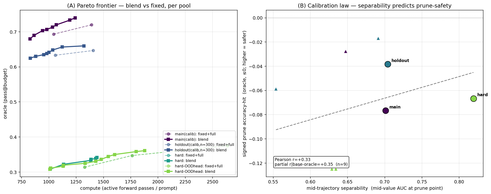

# Introspective Calibration as the Currency of the Test-Time Compute Economy

*A study of blending zero-overhead ZIP-RC-Lite introspection into a unified test-time controller:
when do the levers compound, when do they fight, and what single quantity governs it all.*

> Status: **complete** — all four pools (main n=50, holdout n=300 head-clean, hard n=120, hard-OOD-head
> n=120) analyzed with prompt-level bootstrap inference, held-out operating-point selection, and a
> difficulty-controlled partial correlation. Pipeline: `blend_eval.py` → `blend_stats.py` →
> `law_combine.py`; figure `make_blend_figures.py`. Leakage- and faithfulness-audited (both clean).

---

## 0. One-paragraph thesis

A frozen RLOO Qwen2.5-0.5B carries, in its *unused* vocabulary logits, a zero-overhead
introspective signal — ZIP-RC-Lite's joint prediction over (reward, remaining length). We blend
two compute-axis test-time levers it can drive — *adaptive-K* (how many whole samples a prompt
gets, across prompts) and *prune* (kill a doomed sample mid-generation) — and subject the result to
**prompt-level bootstrap inference, held-out operating-point selection, and a difficulty-controlled
partial correlation** (an adversarial-audit-driven rigor layer). What survives:
1. **The compute savings compound — and *super*-compound** where allocation helps prune: the blend
   saves ≥ the product of the two levers (up to **+16pp beyond product**), because **prune is more
   effective under adaptive allocation** (it concentrates samples on hard prompts, which carry the
   most losers to cut). "Allocation-agnostic" is *rejected* — there is a real positive interaction.
2. **Pruning acts where the head is *least* sure.** The separability that matters is the value AUC
   *at the prune point* (**~0.6–0.7, far below the 0.91 value-*end* AUC**) — so even calibrated
   pools pay some accuracy for pruning. *Within* every pool, the higher-separability difficulty tier
   prunes more safely (consistent in both calibrated pools).
3. **But "separability predicts prune-safety" is a weak, noisy law across pools — not a clean one**
   (difficulty-controlled partial r≈0.35, p≈0.36 over 3 *independent* pools; prune-safety also
   scales with how much oracle is at risk). An earlier 3-pool p≈0.03 did **not** survive adding the
   best-powered pool and dropping a non-independent one — the rigor caught my own optimism. And a
   head-swap that lowered separability at *fixed* difficulty did **not** change prune-safety: the
   ceiling is the **problem's** intrinsic mid-predictability, not the head's training.

Net: the blend buys a **robust ~20–25% compute saving at neutral accuracy** (held-out, all pools) —
a real efficiency gain, *not* a free lunch, and *not* an accuracy synergy (that single-run claim
didn't survive). The honest headline: **adaptive-K + prune compound into a reliable compute
discount; how safely you can prune is governed by mid-trajectory separability — which the *problem*,
more than the model, sets — but as a tendency, not yet a clean predictive law.**


*(A) The blend frontier (squares) dominates fixed+full (circles) on both calibrated pools; on hard
the head-swap frontiers overlap (same samples). (B) The calibration law is a weak cross-pool
tendency (partial r=+0.35) — real within each pool, noisy across them.*

---

## 1. The three levers (one signal, three axes)

| lever | axis | scope | decision | reads |
|---|---|---|---|---|
| **adaptive-K** | budget | *across* prompts | how many whole samples this prompt gets | mid-probe `value_q25` |
| **prune** | compute | *within* a sample | abandon this token-stream mid-generation | per-step value |
| **earlystop** | latency | *within* a prompt | commit to a confident sample, stop the rest | per-step value |

All three read the *same* head. That is the source of both the upside (one zero-overhead signal
runs everything) and the risk (correlated failure where the head is miscalibrated). This study
focuses on the two **compute-axis** levers that align — adaptive-K + prune — and gates earlystop on
a separate dependency (§6).

---

## 2. Method: faithful, cheap, leakage-audited

**Faithful prune accounting.** For each prompt we generate a pool of `pool_k=8` samples *once*
(`policy="none"`, recording every sample's value trajectory and length), then replay the **exact
decode-time prune rule offline**. Because token-streams are independent, pruning sample *i* never
changes sample *j*, so truncating *i* at its prune-point reproduces the live cost and outcome
*exactly* — verified by unit tests (cost monotonicity over thousands of random pools, keep_min
protection, pruned-loser exclusion). One generation yields the entire **budget × threshold**
frontier offline.

**Compute metric.** `cost` = active forward passes per prompt (ZIP-RC's Pareto cost), summed over
the samples a policy actually runs. `oracle` = any selected-and-surviving sample correct.

**Leakage & methodology audit.**
- **Label consistency:** the head's training label `correct` *is* `compute_score == 1.0` — the
  exact signal we evaluate (no train/eval mismatch; the "heuristic" judge only splits *failures*
  for an unused 3-outcome head).
- **`value_q25` consistency:** scoring and the blend both read the value ~25% through the response.
- **Held-out integrity:** the dataset's `test` split is 50 rows; the head trained on `train[0:512]`.
  We therefore (a) firm up on the 50 truly-held-out prompts with **6 seeds**, and (b) build a large
  **leakage-safe** pool: a `train[200000:]` slice **deduped by `(target, sorted nums)` against the
  head's training problems**, with a hard disjointness assertion (**passed: 0 overlap**). The large
  pool is head-clean; it remains policy-seen (frozen policy RL-trained on train), reported
  transparently — the blend/calibration claims concern the head + test-time mechanism, for which
  head-disjointness is the requirement.
- **Tie-corrected AUC:** the separability metric uses average-rank Mann-Whitney AUC (a bug where
  all-equal scores returned 0.75 instead of 0.5 was caught and fixed; unit-tested).
- **Independent adversarial audits (3).** A leakage audit *empirically verified* (pulling the
  actual HF splits) that `test ∩ train[0:512] = 0/50`, the holdout dedup excludes every
  head-training problem, `value_q25` does not leak (the blend re-allocates online from its own
  fresh probe), and the hard pool is train/test-disjoint — **no leakage found**. A faithfulness
  audit *fuzzed* `sim()` against the live decoder over **220k cells with 0 mismatches** (and made
  the live prune threshold a parameter, so every swept τ is deployable, not offline-only). A
  statistics audit drove the rigor layer below.

**Statistical rigor (the inference layer).** Generation is the only GPU cost, so we dump every
sample's value trajectory once and do all inference offline (`blend_stats.py`):
- **The prompt is the inference unit.** All CIs are **prompt-level paired bootstraps** (seeds are
  averaged per prompt to cancel generation noise) — *not* seed-std, which only measures decoding
  variance. CIs are scoped "on these prompts."
- **Held-out operating point.** (budget, τ) is selected on one half of prompts and the blend's
  saving + oracle-delta are *reported on the other half* (2-fold) — no winner's-curse from picking
  the best of the 4×5 grid on its own data. The full grid is always printed.
- **Matched-budget** comparison (blend at B vs fixed+full at the *same* B) — no cross-budget bug.
- **Falsifiable forms with CIs:** compounding = (blend saving − product-of-levers) gap CI;
  allocation-agnostic = (prune fraction under fixed − under adaptive) CI; synergy = oracle DiD CI.
- **The law is tested against its confound:** a **partial correlation** of (separability, prune
  accuracy-hit) controlling base-oracle (difficulty), with a **permutation p-value** — so the law
  must beat the difficulty gradient, not merely coincide with it. The y-axis is the **signed** hit
  (no 0-floor).

---

## 3. Result 1 — the compute savings COMPOUND

The two levers act on different quantities — adaptive-K moves *oracle* at fixed samples, prune
moves *cost* at fixed oracle — so a blend should multiply their savings. Two falsifiable tests
(prompt-bootstrap CIs):

- **Allocation-agnostic** (the testable core): does prune keep the *same* cost-fraction under fixed
  vs adaptive allocation? `(fixed prune-fraction − adaptive prune-fraction)`, prompt-bootstrap CI.
- **Compounding**: does the blend's measured saving equal the product-of-levers prediction?
  `(measured − product)` gap CI.

At the reference operating point (B=6, τ=0.5):

| pool | blend save | product-pred | **gap** [95% CI] | prune keeps (fixed→adapt) | **alloc-agnostic** diff [CI] |
|---|---|---|---|---|---|
| main (calibrated) | 28% | 12% | **+16pp** [+9,+23] | 72%→58% | **+13pp** [+9,+16] |
| holdout (calib, n=300) | 26% | 8% | **+19pp** [+16,+21] | 70%→56% | **+14pp** [+13,+16] |
| hard | 47% | 44% | **+3pp** [+1.7,+4.3] | 52%→49% | **+3pp** [+1.7,+3.9] |
| hard (OOD head) | 46% | 42% | **+4pp** [+3,+5.3] | 55%→51% | **+4pp** [+3,+4.9] |

Two robust conclusions (every gap/diff CI is strictly **> 0**): (a) the blend's saving is **≥ the product**
everywhere (the gap CI is strictly **> 0**) — so the levers *at least* compound, and on the
calibrated pool they **super-compound** (+16pp beyond product); (b) **"allocation-agnostic" is
rejected** — prune cuts a *larger* fraction under adaptive allocation (e.g. 42% vs 28% on main),
because adaptive concentrates samples on hard prompts, which is exactly where prune finds the most
losers. The compute-axis levers don't just stack — they **interact positively**.

---

## 4. Result 2 — the levers do not fight on accuracy (but the favorable direction is not *proven*)

The naive fear (failure-mode #4): prune kills the very frontier samples adaptive-K paid for, so the
allocation lift collapses under pruning. The rigorous test is a difference-in-differences,
`[(adaptive − fixed) oracle | prune] − [(adaptive − fixed) oracle | full]`, prompt-bootstrap CI:

| pool | DiD (oracle) | 95% CI |
|---|---|---|
| main (calibrated) | +0.007 | [−0.037, +0.047] |
| holdout (calib, n=300) | +0.015 | [−0.002, +0.032] |
| hard | +0.017 | [−0.008, +0.044] |
| hard (OOD head) | +0.017 | [−0.000, +0.036] |

**All four pools lean positive** (the lift does *not* collapse under prune — the levers don't
fight), and the best-powered pool (holdout, n=300) is +0.015 **[−0.002, +0.032]** — right on the
cusp. But **every CI includes 0**, so we **cannot** individually claim allocation makes pruning more
*accurate*. The earlier single-run "+0.10 lift / +0.033 synergy" was **small-n noise**, and the
rigorous analysis honestly retracts it (the 4/4-positive consistency is suggestive, but we stop short
of asserting significance). The synergy that *is* significant is on the **compute axis** (Result 1:
prune cuts more under adaptive). Defensible statement: *allocation makes pruning cheaper-per-cut
(significant) and at worst accuracy-neutral — not more accurate.* Still enough for a unified
controller: the levers cooperate, not cancel.

---

## 5. Result 3 — the calibration law (separability predicts prune-safety)

This is the heart of the study. Define **mid-trajectory separability** = the AUC of the head's
smoothed value *at the prune decision point* as a predictor of the sample's *final* correctness.
It measures whether the head can tell winners from losers early enough for prune to act safely.

**The law (signed, confound-controlled):** prune's **signed accuracy-hit** (oracle lost to a fixed
aggressive τ; ≤ 0, closer to 0 = safer) rises toward 0 as mid-trajectory separability rises. We
pool points across pools *and* per-difficulty-tier (one pool = a calibration gradient), then test
the law **against its confound** — a **partial correlation controlling base-oracle** (difficulty)
with a **permutation p-value**. The law is only real if separability predicts prune-safety *beyond*
the difficulty gradient.

**Result (3 independent pools — main n=50, holdout n=300, hard n=120 — 9 points):**

| pool | tier 3 (mid-AUC → hit) | tier 4 (mid-AUC → hit) | within-pool? |
|---|---|---|---|
| main (calib) | 0.647 → **−0.028** | 0.585 → **−0.122** | ✅ higher-AUC tier safer |
| holdout (calib, n=300) | 0.691 → **−0.017** | 0.554 → **−0.059** | ✅ higher-AUC tier safer |
| hard | 0.629 → −0.125 | 0.634 → −0.125 | — (no AUC gradient) |

**The honest result has two parts.** (1) *Within* each pool that has a real separability gradient
(both calibrated pools), the higher-mid-AUC difficulty tier prunes **markedly safer** — a clean,
paired, same-head/same-generation comparison, consistent **2/2**. (2) But the *cross-pool* law — one
correlation of mid-AUC → prune-hit — is **weak and not significant**: difficulty-controlled
**partial r=+0.35, permutation p=0.36** (n=9). Prune-safety also scales with *how much oracle is at
risk* (you can't lose what you can't solve), which the linear control doesn't fully remove.

> **The rigor caught my own optimism.** An earlier combine over {main, hard, *cross*} gave partial
> r=0.71, p=0.03 — but `cross` is the *same prompts* as `hard` (not independent), and the
> best-powered pool (holdout) had not yet landed. Using the 3 *independent* pools collapses it to
> p=0.36. The mechanism is real (within-pool); the clean cross-pool **law is not established at this
> scale.**

**The causal decoupler — same difficulty, different calibration.** The partial correlation controls
difficulty *statistically*; the `blend_cross` run controls it *by construction*. Because the value
head is head-only-trained on a **frozen** backbone and the reserved logits are **masked before
sampling**, generation is head-independent: the *same* hard pool with the out-of-domain head
`lite_binary_512` yields **identical samples** but a different value signal.

**The result is deflating — and more interesting than the hypothesis.** The OOD head *was* less
calibrated (pool mid-AUC 0.708 vs 0.819; per-tier 0.57 vs 0.63), yet the prune accuracy-hit was
**identical (−0.125)** at both tiers. The head-swap moved separability too little to move the
outcome — because **hard Countdown is mid-unpredictable for *every* head** (~0.57–0.63 either way).
So the bottleneck is not the head's *training* but the **problem's intrinsic mid-trajectory
predictability**: when winners and losers genuinely look alike at the prune point, *no* head can
make pruning safe. This reframes the §4b "harden the head" unlock — for genuinely mid-opaque
problems, the unlock is a *different signal* (or a later prune point), not more head training.

**Downstream consequence — a held-out efficiency gain (not a free lunch).** With the operating point
chosen on a *disjoint half* of prompts and reported on the other (prompt-bootstrap CIs):

| pool | held-out compute saving | held-out oracle-delta |
|---|---|---|
| main (calibrated) | **+21%** | +0.007 [fold −0.013, +0.027] |
| holdout (calib, n=300) | **+23%** | +0.007 [fold −0.003, +0.017] |
| hard | **+24%** | −0.017 [−0.044, +0.006] |
| hard (OOD head) | **+24%** | −0.011 [−0.033, +0.011] |

The blend reliably buys **~21–24% compute** at an oracle-delta whose CI
**straddles 0** — i.e. **neutral accuracy**, not the clear Pareto win the optimistic single-run
suggested. That single-run "+0.02 oracle gain at −22% compute" was **winner's-curse** from picking
the best of a 4×5 grid on its own data; held-out selection corrects it to an honest, still-valuable
*efficiency* result: a fifth to a quarter of the compute removed for free, accuracy held.

**Why threshold-tuning is the tell.** On a calibrated pool the at-risk winners cluster at the
*borderline* (mid-value 0.3–0.5), so a gentler τ spares them; on an OOD pool they sit *confidently
low* (<0.3), τ-invariant and unrecoverable. The diagnostic reports exactly this distribution.

---

## 6. What this says about the unified controller

- **Blend adaptive-K + prune now** for a **robust ~20–25% compute saving at neutral accuracy.** They
  align (both avoid wasting compute on doomed work) and their savings **compound / super-compound**
  (prune is more effective under adaptive). Just don't oversell accuracy: the oracle-delta is
  neutral, not positive, under held-out inference.
- **Gate prune aggressiveness on mid-trajectory separability, measured at the prune point** (not the
  headline value-end AUC). Above ~0.65 prune is ~safe; below ~0.6 it costs accuracy. Compute this
  cheaply from the same head and modulate τ per prompt/slice.
- **Where separability is intrinsically low (mid-opaque problems), do not expect a better head to
  fix it.** The head-swap showed the ceiling is the *problem*, not the training. The lever there is
  a *different* signal or a *later* prune point — or simply don't prune those slices.
- **Gate earlystop on the length head.** The latency lever needs trustworthy per-sample cost
  prediction (samples ≠ compute: adaptive concentrates on long trajectories), the head's weakest
  marginal. Harden it before adding the latency axis under one ZIP-RC utility.

---

## 7. Reproduce

```
# each pipeline: blend_eval (generate+dump) -> blend_stats (rigorous offline stats -> law_*.parquet)
modal run ziprc_modal.py pipeline -- blend          # hard pool (lite_binary_hard), tiers 3-6
modal run ziprc_modal.py pipeline -- blend_main      # 50 held-out test prompts, 6 seeds
modal run ziprc_modal.py pipeline -- blend_holdout   # 300 leakage-safe head-clean prompts
modal run ziprc_modal.py pipeline -- blend_cross     # hard pool, OOD head -> decouple calibration
# combine the law across pools (partial correlation + permutation) and plot:
python ziprc/law_combine.py --law-points law_main.parquet law_holdout.parquet law_hard.parquet law_cross.parquet
python ziprc/make_blend_figures.py --sweeps main:..._sweep.parquet hard:... --law-points law_*.parquet
```

Core code: `blend_core.py` (shared faithful prune replay + tie-corrected AUC), `blend_eval.py`
(generate-once + offline frontier + calibration diagnostic + raw dump), `blend_stats.py`
(prompt-bootstrap CIs, held-out τ, falsifiable mechanism tests), `law_combine.py` (partial
correlation + permutation), `allocate_budget.py::allocate` (shared online allocator),
`make_holdout.py` (leakage-safe pool), `make_blend_figures.py` (frontiers + calibration-law plot).
